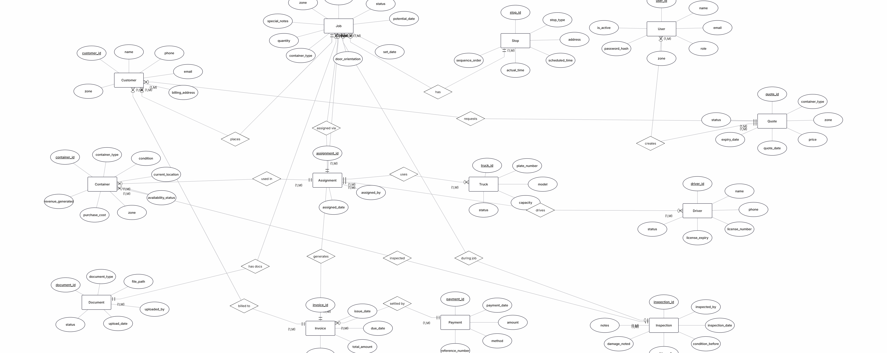
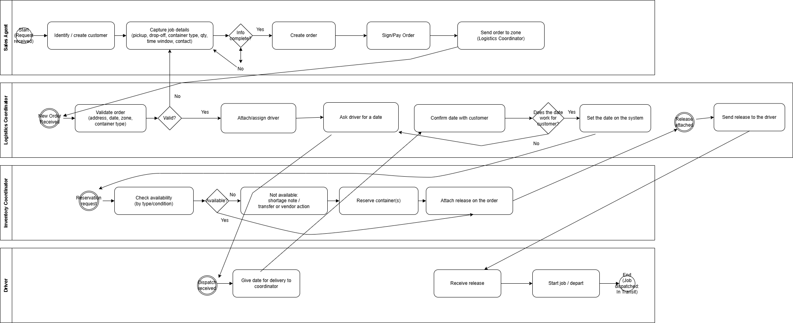

#  Container Delivery Management System

##  Project Description

A Container Delivery Management System is an integrated platform designed to help container delivery companies manage their operations in one centralized place. It covers the full delivery lifecycle — from job creation and resource assignment, to delivery tracking, proof of delivery, invoicing, and payment management.

This system brings together all key operational roles — dispatchers, drivers, yard staff, and accountants — into a single environment, eliminating manual processes and reducing scheduling conflicts. By providing real-time job tracking, document management, and financial reporting, the platform empowers the company to operate more efficiently, deliver consistently, and maintain clear financial records.

---

##  Contributors

- **Brian Doci**
- **Irda Elezi**
- **Antigoni Dinko**

---

## 📁 Repository Structure

```
📁 Use-Case-Diagrams/        → UML use case diagram + use case tables
📁 Data-Flow-Diagrams/       → DFD Level 0 (context) + DFD Level 1 (processes)
📁 ERD/                      → Entity Relationship Diagram
📁 documentation/            → Full written analysis and design documentation
📄 README.md                 → Project overview (this file)
```

---

##  Main System Flow

> **Job request → Assign resources → Deliver → Proof of Delivery → Invoice → Payment**

1. A job is created with pickup/drop-off location, date, container type, and quantity.
2. A dispatcher assigns a container, truck, and driver to the job.
3. The driver picks up the container and updates the job status throughout delivery.
4. Proof of delivery (POD) is uploaded upon completion.
5. An invoice is generated and payment is tracked.

---

##  System Modules

### Customers
- Customer information and billing details
- Optional: contracts and pricing agreements

### Jobs (Orders)
- Create and manage delivery jobs
- Job status lifecycle: `Draft → Confirmed → Assigned → In Transit → Delivered → Closed → Invoiced`
- Notes and file attachments per job

### Containers
- Container registry (ID, type, size, condition)
- Real-time location tracking (yard / customer site / on truck)
- Status: Available / Reserved / In Use
- Damage and inspection reports

### Trucks & Drivers
- Truck list with basic vehicle info
- Driver list with license expiry tracking
- Assign driver + truck combinations to jobs

### Scheduling / Dispatch
- Dispatch board (calendar and list view)
- Conflict detection (same truck or driver double-booked)

### Documents
- Delivery note / waybill
- Proof of Delivery (POD)
- Container handover and return forms
- Damage checklist

### Invoices & Payments
- Auto-generate invoices after delivery
- Track paid / unpaid invoices
- Optional: extra charges (waiting time, additional stops)

### Reports
- Jobs per week / month
- On-time delivery rate
- Truck and container utilization
- Revenue per customer
- Unpaid invoice overview

---

##  Roles & Users

| Role | Responsibilities |
|---|---|
| **Admin** | Manage users, system configuration, and master data |
| **Dispatcher** | Create jobs, assign containers, trucks, and drivers |
| **Driver** | View assigned jobs, update delivery status, upload POD |
| **Yard Staff** | Manage container check-in/out, condition, and inspections |
| **Accountant** | Create invoices, track payments, generate financial reports |
| **Customer** *(optional)* | Submit job requests and track delivery status |

---

## 🗂️ Core Entities

`Customer` · `Job` · `Stop (pickup/drop-off)` · `Container` · `Truck` · `Driver` · `Assignment` · `Document` · `Invoice` · `Payment` · `Inspection`

---

##  MVP Features (Minimum Viable Product)

1. Add and manage customers
2. Create jobs (pickup / drop-off / date / container type)
3. Assign container + truck + driver to a job
4. Update job status throughout the delivery lifecycle
5. Upload proof of delivery
6. Create invoice and record payment
7. Generate a basic weekly report

---

##  Stakeholders

1. **Company Management** — owners and senior managers interested in operational efficiency and revenue
2. **Dispatchers** — create and manage jobs, assign resources, monitor the dispatch board
3. **Drivers** — receive jobs, update status, upload proof of delivery
4. **Yard Staff** — manage physical containers, check-in/out, and inspections
5. **Accountants / Finance** — invoicing, payment tracking, and financial reporting
6. **Customers** — request deliveries and optionally track job status
7. **System Administrator** — user management, system configuration, and security
8. **IT Support / Developers** — system maintenance, reliability, and updates
9. **Regulatory Authorities** *(external)* — compliance with transportation and documentation requirements

---

##  About

This repository is the course project for **Software Engineering Analysis and Design**, Second Year Second Semester, at **University Metropolitan Tirana**.

## Diagrams

### User Cards


### Onion Diagram

The onion diagram shows stakeholder proximity to the core system — inner layers interact directly with CDMS daily, outer layers have indirect or oversight roles.


### ER Diagram
An Entity-Relationship (ER) diagram is a visual map used in database design to show how "entities" (like people, objects, or concepts) relate to one another within a system.



### BPMN Diagrams
A BPMN (Business Process Model and Notation) diagram is a standardized flowchart used to visualize, analyze, and automate business processes.


