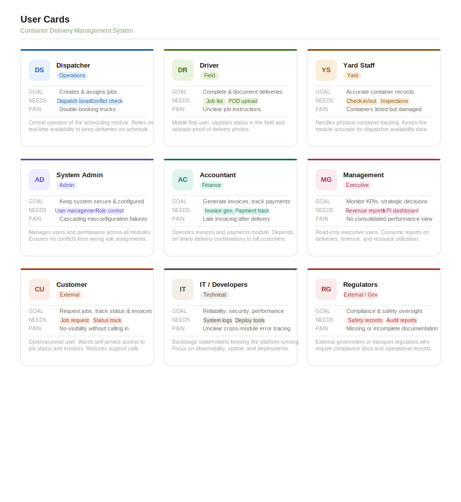
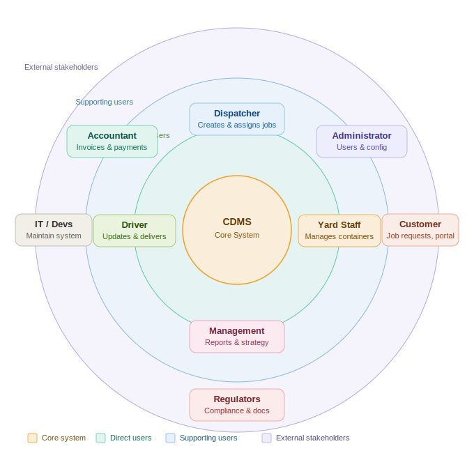

# swe-analysis-design
# Container Delivery Management System

## What it is
An app for a container delivery company to manage jobs, containers, trucks, drivers, documents, and invoices in one place.

## Main flow
*Job request → Assign resources → Deliver → Invoice*
1. A job is created (pickup, drop-off, date, container type, quantity).
2. A dispatcher assigns container(s), a truck, and a driver.
3. The driver delivers and updates the job status.
4. Proof of delivery is saved.
5. An invoice is created and payment is tracked.

## Modules

### Customers
- Customer info
- Contracts/prices (optional)
- Billing details

### Jobs (Orders)
- Create and edit jobs
- Job status:
  - Draft → Confirmed → Assigned → In Transit → Delivered → Closed → Invoiced
- Notes and file uploads

### Containers
- List of containers (ID, type, condition)
- Where each container is (yard, customer site, on truck)
- Available / reserved / in use
- Damage and inspection reports

### Trucks & Drivers
- Truck list and basic info
- Driver list and license expiry
- Assign driver + truck to jobs

### Scheduling / Dispatch
- Dispatch board (calendar/list)
- Check conflicts (same truck/driver booked twice)

### Documents
- Delivery note / waybill
- Proof of delivery (POD)
- Container handover/return form
- Damage checklist

### Invoices & Payments
- Create invoice after delivery
- Track unpaid/paid
- Extra charges (waiting time, extra stop) (optional)

### Reports
- Jobs per week/month
- On-time deliveries
- Truck/container usage
- Revenue per customer
- Unpaid invoices

## Roles (users)
- *Admin*: manage users and system data
- *Dispatcher*: create jobs, assign containers/trucks/drivers
- *Driver*: see assigned jobs, update status, upload POD
- *Yard staff*: update container check-in/out and inspections
- *Accountant*: invoices, payments, reports
- *Customer (optional)*: request jobs and track status

## Main data (entities)
Customer, Job, Stop (pickup/drop-off), Container, Truck, Driver, Assignment, Document, Invoice, Payment, Inspection, Maintenance (optional).

## MVP features (minimum)
1. Add customers
2. Create jobs (pickup/drop-off/date/container type)
3. Assign container + truck + driver
4. Update job status
5. Upload proof of delivery
6. Create invoice and record payment
7. Basic weekly report

## Stakeholders
1. Company Management

Owners or senior managers of the container delivery company.

Interested in business performance, operational efficiency, and revenue reports.

Use system reports to make strategic decisions.

2. Dispatchers

Responsible for creating jobs and assigning trucks, containers, and drivers.

Use the scheduling/dispatch module to manage deliveries and avoid conflicts.

Depend on the system for real-time job management.

3. Drivers

Receive assigned delivery jobs through the system.

Update job status (in transit, delivered).

Upload proof of delivery (POD) and delivery documents.

4. Yard Staff

Manage the physical containers in the yard.

Update container check-in/check-out, condition, and inspection reports.

Ensure containers are available and ready for assignments.

5. Accountants / Finance Department

Handle invoices, payments, and financial tracking.

Use the system to generate invoices and monitor unpaid payments.

Produce financial reports.

6. Customers

Companies or individuals requesting container delivery services.

Provide job requests and delivery information.

May track delivery status and invoices through the system (if a customer portal exists).

7. System Administrator

Responsible for maintaining the system, managing users, and configuring data.

Ensures the system runs correctly and securely.

8. IT Support / Developers

Maintain, update, and troubleshoot the system.

Ensure system reliability, security, and performance.

9. Regulatory Authorities (External Stakeholder)

Government or transportation regulators who may require documentation, safety compliance, and operational records.

## Diagrams

### User Cards

### Onion Diagram

The onion diagram shows stakeholder proximity to the core system — inner layers interact directly with CDMS daily, outer layers have indirect or oversight roles.

